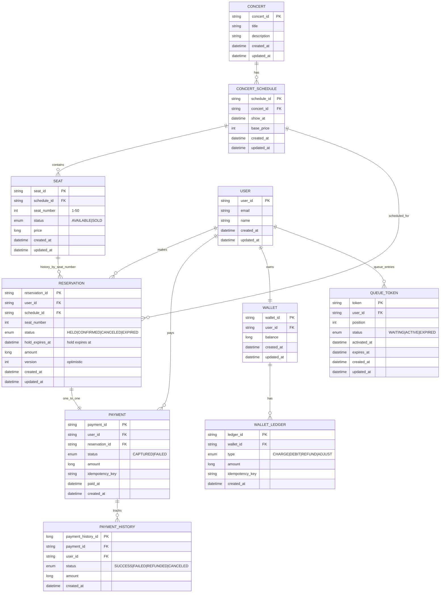

# 🎫 콘서트 예약 서비스 - DB & ERD

### ✅ 체크리스트

* [ ] 테이블 관계가 도메인과 일치(예약/좌석/결제/잔액/사용자)
* [ ] FK/제약/인덱스/유니크키/체크로 무결성·성능 보장
* [ ] 트랜잭션 경계/격리수준 정의, 락 전략(row lock/Optimistic version)
* [ ] 롤백 플랜

# 🔎 모델링 포인트 & 도메인 엔터티 상세

## 핵심 모델링 원칙

* **SEAT(좌석)는 영구 상태만 유지**: `AVAILABLE` / `SOLD`
* **임시배정(홀드)은 `RESERVATION(HELD)` + `hold_expires_at`로 표현** 
  <br>→ 만료 시 EXPIRED, 결제 시 CONFIRMED.
* **시간축 이력**: 하나의 좌석은 시간 경과에 따라 여러 `RESERVATION`과 연결될 수 있음(1\:N)
* **활성 예약만 중복 금지**: `UNIQUE(schedule_id, seat_number) WHERE status IN ('HELD','CONFIRMED')`
* **Idempotency 보장**: `PAYMENT(user_id, idempotency_key)` / `WALLET_LEDGER(wallet_id, idempotency_key)` 유니크
* 대기열 활성화(슬롯 할당): Redis ZSET(대기열) + active:{user}(TTL)로 활성 슬롯 N 유지
* 일관성 보호: Redis 분산락(TTL) + DB 부분 유니크 이중 방어, Redis–DB 정합성 워커로 불일치 자동 치유
* 거래(결제) 원자성: 하나의 트랜잭션에 wallet, wallet_ledger, payment, reservation, seat 동시 커밋
* 가시성 레이어 분리: 화면 표시는 HELD_BY_SELF / HELD_BY_OTHERS를 실시간 홀드 유무로 가공
---
## 📊 시스템 개요

| 구분        | 값                                                               |
| --------- |-----------------------------------------------------------------|
| 전체 Entity | **10개**                                                         |
| 도메인       | **6개** (대기열, 사용자, 카탈로그(날짜/좌석), 예약, 결제, 잔액)                      |
| 관계(주요)    | **12개 내외**                                                      |
| 좌석 범위     | 1–50번                                                           |
| 핵심 제약     | 좌석 중복 방지, Idempotency 보장, TTL 만료, Row-level Lock                |
| 동시성 제어    | Redis Lua(SETNX+TTL), DB 트랜잭션(SELECT…FOR UPDATE), 낙관적 버전, 정합성워커 |
| 확장성       | 활성 슬롯 N, 배치 승격(초당 M명), 멀티 AZ/오토스케일                              |

--- 
### 확장 요약

* **도메인**

    * 대기열(Queue): 토큰 발급/승격/만료, 활성 슬롯 제어
    * 사용자(User): 식별/인증, 권한
    * 카탈로그(Catalog): 예약 가능 **날짜/좌석** 공개
    * 예약(Reservation): 좌석 \*\*홀드(HELD)\*\*와 만료, 최종 확정(BOOKED)
    * 결제(Payment): 멱등 결제, 내역 추적
    * 잔액(Balance): 충전/차감, 음수 방지

* **주요 엔터티(예)**

    * `users`, `user_balance`, `reservation_dates`, `seats`, `payments`, (+운영용 지표/이벤트 테이블 선택)

* **대표 관계**

    * User 1–1 Balance, Date 1–N Seats, Seat 1–1(최종) Payment, User 1–N Payments 등

* **운영 상수 & 정책**

    * **홀드 TTL**: 기본 5분 (테스트 환경 2초)
    * **활성 슬롯 N**: 동시 활성 유저 수 제한(예: 1,000)
    * **승격 주기**: 초당 M명(예: 100/s) 배치 승격

---
## ERD

---
## index/query 계획 표

| 테이블      | 핵심 쿼리                                              | 인덱스                                 | 기대 효과    |
| -------- |----------------------------------------------------| ----------------------------------- | -------- |
| **seats**          | `WHERE schedule_id=? ORDER BY seat_number`         | `UNIQUE(schedule_id, seat_number)`            | 회차 내 좌석 고유 + 목록 정렬 빠름     |
| **reservation**    | *활성 중복 방지/가용 체크*                                   | `INDEX(schedule_id, seat_number, status)` | 중복 배정 방지(하드스톱) / 가용 판단 보조 |
| **payments**       | *멱등성 검사*                                           | `UNIQUE(user_id, idempotency_key)`         | 재시도에도 1회 처리               |
| **wallet\_ledger** | *충전/차감 멱등*                                         | `UNIQUE(wallet_id, idempotency_key)`        | 지갑 원장 중복 방지               |
| **queue\_token**   | `WHERE status='WAITING' ORDER BY position LIMIT ?` | `INDEX(status, position)`                      | 대기열 조회/선정 O(logN)         |


## 🏗️ 도메인별 Entity 상세

### 🎵 콘서트 도메인

**CONCERT**

| 필드                        | 타입       | 설명                          |
| ------------------------- | -------- | --------------------------- |
| concert\_id (PK)          | UUID     | 콘서트 ID                      |
| title                     | String   | 콘서트 제목                      |
| description               | String   | 설명                          |
| start\_date / end\_date   | Date     | 전시/공연 기간                    |
| status                    | Enum     | `PUBLISHED` / `UNPUBLISHED` |
| created\_at / updated\_at | DateTime | 생성/수정                       |

**CONCERT\_SCHEDULE**

| 필드                        | 타입       | 설명     |
| ------------------------- | -------- | ------ |
| schedule\_id (PK)         | UUID     | 스케줄 ID |
| concert\_id (FK)          | UUID     | 콘서트 ID |
| show\_at                  | DateTime | 공연 일시  |
| base\_price               | Integer  | 기본가    |
| created\_at / updated\_at | DateTime | 생성/수정  |

**SEAT**

| 필드                        | 타입       | 설명                    |
| ------------------------- | -------- |-----------------------|
| seat\_id (PK)             | UUID     | 좌석 ID                 |
| schedule\_id (FK)         | UUID     | 스케줄 ID                |
| seat\_number              | Int      | 좌석번호(1\~50)           |
| price                     | Int      | 가격                    |
| status                    | Enum     | `AVAILABLE` / `SOLD`  |
| created\_at / updated\_at | DateTime | 생성/수정                 |

> 제약: **Unique(schedule\_id, seat\_number)** – 회차 내 좌석 고유

---

### 👤 사용자/대기열 도메인

**USER**

| 필드                        | 타입       | 설명 |
|---------------------------| -------- | -- |
| user\_id (PK)             | UUID     | 사용자 ID |
| email(UNIQUE)                 | String   | 이메일|
| name                      | String   | 이름 |
| created\_at / updated\_at | DateTime | 생성/수정 |

**QUEUE\_TOKEN**

| 필드                          | 타입       | 설명                               |
| --------------------------- | -------- | -------------------------------- |
| token (PK)                  | String   | 대기열 토큰                           |
| user\_id (FK)               | UUID     | 사용자 ID                           |
| position                    | Int      | 대기 순번                            |
| status                      | Enum     | `WAITING` / `ACTIVE` / `EXPIRED` |
| activated\_at / expires\_at | DateTime | 활성/만료 시각                         |
| created\_at / updated\_at   | DateTime | 생성/수정                            |

---

### 📋 예약 도메인

**RESERVATION**

| 필드                        | 타입       | 설명                                            |
| ------------------------- | -------- |-----------------------------------------------|
| reservation\_id (PK)      | UUID     | 예약 ID                                         |
| user\_id (FK)             | UUID     | 사용자                                           |
| schedule\_id (FK)         | UUID     | 회차                                            |
| seat\_number              | Int      | 좌석 번호                                         |
| status                    | Enum     | `HELD` / `CONFIRMED` / `CANCELED` / `EXPIRED` |
| hold\_expires\_at         | DateTime | 임시배정 만료 시각                                    |
| amount                    | Int      | 결제 예정 금액                                      |
| version                   | Int      | Optimistic Locking 버전                         |
| created\_at / updated\_at | DateTime | 생성/수정                                         |

> 제약(Partial Unique): `UNIQUE(schedule_id, seat_number) WHERE status IN ('HELD','CONFIRMED')`

---

### 💳 결제/월렛 도메인

**PAYMENT**

| 필드                           | 타입       | 설명                    |
| ---------------------------- | -------- | --------------------- |
| payment\_id (PK)             | UUID     | 결제 ID                 |
| user\_id (FK)                | UUID     | 사용자                   |
| reservation\_id (FK, UNIQUE) | UUID     | 예약 ID                 |
| status                       | Enum     | `CAPTURED` / `FAILED` |
| amount                       | Long     | 결제 금액                 |
| idempotency\_key             | String   | 멱등 키(Unique by user)  |
| paid\_at / created\_at       | DateTime | 결제 시각/생성              |

> 제약: `Unique(user_id, idempotency_key)` – Idempotency 보장

**PAYMENT\_HISTORY**

| 필드                        | 타입       | 설명                                              |
| ------------------------- | -------- | ----------------------------------------------- |
| payment\_history\_id (PK) | UUID     | 이력 ID                                           |
| payment\_id (FK)          | UUID     | 결제 ID                                           |
| user\_id (FK)             | UUID     | 사용자                                             |
| status                    | Enum     | `CAPTURED` / `FAILED` / `REFUNDED` / `CANCELED` |
| amount                    | Long     | 금액                                              |
| created\_at               | DateTime | 생성                                              |

**WALLET**

| 필드                        | 타입       | 설명       |
| ------------------------- | -------- | -------- |
| wallet\_id (PK)           | UUID     | 월렛 ID    |
| user\_id (FK, UNIQUE)     | UUID     | 사용자별 1지갑 |
| balance                   | Long     | 잔액(원)    |
| created\_at / updated\_at | DateTime | 생성/수정    |

**WALLET\_LEDGER**

| 필드               | 타입       | 설명                                       |
| ---------------- | -------- | ---------------------------------------- |
| ledger\_id (PK)  | UUID     | 원장 ID                                    |
| wallet\_id (FK)  | UUID     | 월렛                                       |
| type             | Enum     | `CHARGE` / `DEBIT` / `REFUND` / `ADJUST` |
| amount           | Long     | 금액(+/-)                                  |
| idempotency\_key | String   | 멱등 키(Unique by wallet)                   |
| created\_at      | DateTime | 생성                                       |

> 제약: `Unique(wallet_id, idempotency_key)` – Idempotency 보장

---

## 🔗 핵심 관계/제약 요약

| 관계                                    | 카디널리티 | 비고              |
| ------------------------------------- | ----- | --------------- |
| CONCERT → CONCERT\_SCHEDULE           | 1\:N  | 콘서트-회차          |
| CONCERT\_SCHEDULE → SEAT              | 1\:N  | 회차-좌석(1..50)    |
| CONCERT\_SCHEDULE → RESERVATION       | 1\:N  | 회차-예약           |
| SEAT → RESERVATION                    | 1\:N  | 시간 경과에 따른 예약 이력 |
| USER → RESERVATION / PAYMENT / LEDGER | 1\:N  | 사용자 활동          |
| RESERVATION ↔ PAYMENT                 | 1:1   | 예약 1건 = 결제 1건   |
| PAYMENT → PAYMENT\_HISTORY            | 1\:N  | 결제 상태 전이 이력     |
| USER ↔ WALLET                         | 1:1   | 사용자당 1 월렛       |
| WALLET ↔ WALLET\_LEDGER               | 1\:N  | 지갑 트랜잭션 원장      |
| USER ↔ QUEUE\_TOKEN                   | 1\:N  | 대기열 진입 이력       |

### 부분 유니크 인덱스(권장)

```sql
-- 활성 예약만 중복 금지
CREATE UNIQUE INDEX ux_reservation_active
  ON reservation(schedule_id, seat_number)
  WHERE status IN ('HELD','CONFIRMED');

-- 결제/지갑 멱등성 보장
CREATE UNIQUE INDEX ux_payment_idem ON payment(user_id, idempotency_key);
CREATE UNIQUE INDEX ux_wallet_ledger_idem ON wallet_ledger(wallet_id, idempotency_key);
```

### 락/동시성

* 애플리케이션: `lock:seat:{schedule}:{no}` (Redis 분산락, TTL = hold TTL)
* 데이터베이스: `version`(Optimistic Locking) + **부분 유니크 인덱스**

---

## 📋 Enum 정의 (Java 예시)

```java
public enum QueueStatus {
  WAITING, ACTIVE, EXPIRED;
  public boolean isActive() { return this == ACTIVE; }
}

public enum SeatStatus {
  AVAILABLE,  // 판매 가능 (DB 저장)
  SOLD;       // 판매 완료 (DB 저장)
  public boolean isAvailable() { return this == AVAILABLE; }
  public boolean isSold()      { return this == SOLD; }
}

// 활성 예약(좌석 중복 방지 인덱스 대상)은 HELD, CONFIRMED 두 상태
public enum ReservationStatus {
  HELD, CONFIRMED, CANCELED, EXPIRED;

  /** 좌석 고유 제약(부분 유니크)에 포함되는 활성 상태인지 */
  public boolean countsAsActiveSeat() {
    return this == HELD || this == CONFIRMED;
  }
  /** 최종 상태(되돌릴 수 없음)인지 */
  public boolean isTerminal() {
    return this == CONFIRMED || this == CANCELED || this == EXPIRED;
  }
}

public enum PaymentStatus {
  CAPTURED, FAILED;
  public boolean isCaptured() { return this == CAPTURED; }
  public boolean isFailed()   { return this == FAILED; }
}

public enum PaymentHistoryStatus {
  CAPTURED, FAILED, REFUNDED, CANCELED
}

public enum LedgerType {
  CHARGE, DEBIT, REFUND, ADJUST
}

```

---


*Generated: 2025-09-02 · Project: HangHae Plus Concert Reservation System*
