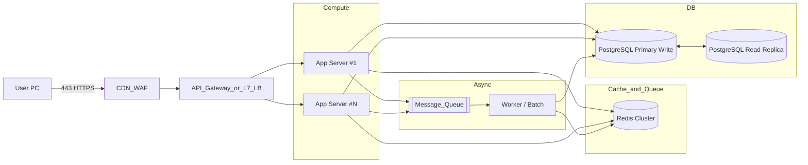
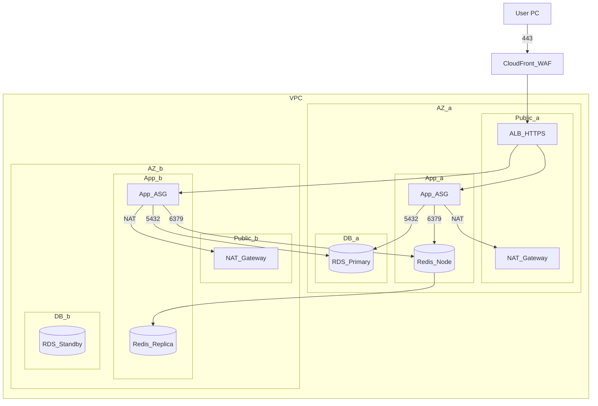
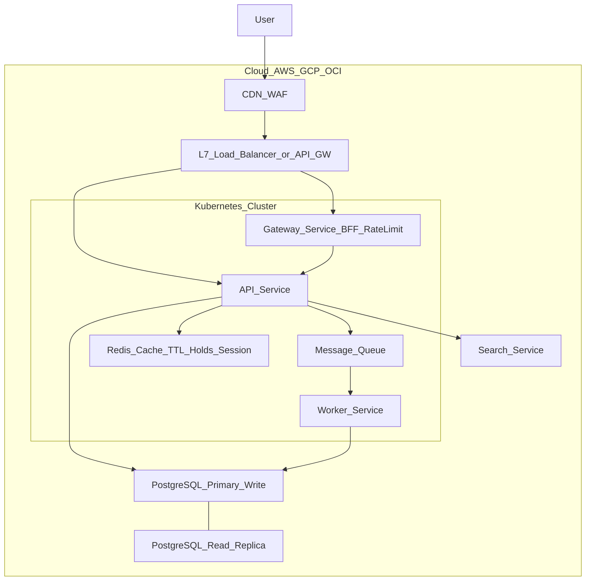

# ☁ Infra 구성도 

---

## 1) High-level 아키텍처

---

## 2) 배포 다이어그램 (AWS VPC / 멀티-AZ)

---

## 3) 보안/네트워크 요약

* **WAF/ALB**: L7 필터링, DDoS 보호(Shield), HTTPS 종단
* **보안 그룹**

    * ALB → App : 443/80 허용 (ALB SG만)
    * App → Redis : 6379 (App SG → Redis SG)
    * App → RDS : 5432 (App SG → DB SG)
    * App/Worker 아웃바운드 → **NAT** 통해 인터넷
* **비밀 관리**: AWS Secrets Manager/SSM Parameter Store

## 4) 운영/확장 포인트

* **오토스케일**: 요청/큐 길이/CPU 기반 ASG(ECS/EKS)
* **멀티 AZ**: RDS Multi-AZ, Redis 복제/클러스터
* **백업/DR**: RDS 자동백업, Redis 스냅샷, IaC(Terraform/CloudFormation)
* **모니터링**: CloudWatch + APM(예: OpenTelemetry/Jaeger) + 대기열 길이/홀드 TTL 만료율 대시보드

---

## 🧱 컴포넌트 인벤토리 (역할/사용 여부)

> 두 가지 패턴 기준: **A = Gateway+Worker+MQ**, **B = 단일 API**.
> 표기: ✅ 사용 / ☑️ 선택(옵션) / ❌ 미사용.

| 컴포넌트                      | 역할(요약)            |  A  |  B  | 매니지드 서비스 예시 (AWS / GCP / OCI)                           |
| ------------------------- | ----------------- | :-: | :-: | ------------------------------------------------------- |
| L7 Load Balancer / API GW | HTTPS 종단, 라우팅, 보호 |  ✅  |  ✅  | ALB / Cloud Load Balancing / OCI LBaaS                  |
| CDN / WAF                 | 엣지 캐시, L7 방어      |  ☑️ |  ☑️ | CloudFront+WAF / Cloud CDN+Armor / OCI CDN+WAF          |
| Kubernetes Orchestrator   | 컨테이너 스케줄링/확장      |  ✅  |  ✅  | EKS / GKE / OKE                                         |
| Containers (Docker)       | 앱 패키징/배포          |  ✅  |  ✅  | Docker / containerd                                     |
| API Service (pod)         | 동기 HTTP API       |  ✅  |  ✅  | –                                                       |
| Gateway Service (pod)     | BFF/인증/레이트리밋      |  ✅  |  ❌  | –                                                       |
| Worker Service (pod)      | 비동기 작업·백그라운드      |  ✅  |  ❌  | –                                                       |
| Message Queue             | 비동기/버퍼링/재시도       |  ✅  |  ❌  | Amazon MQ/SQS / Pub/Sub / OCI Streaming                 |
| Cache (Redis)             | 세션/랭킹/임시홀드 TTL    |  ✅  |  ✅  | ElastiCache Redis / Memorystore / OCI Cache Redis       |
| RDB (PostgreSQL, RW/RO)   | 영속 데이터, 트랜잭션      |  ✅  |  ✅  | RDS / Cloud SQL / OCI DBCS/Aurora-Postgres eqv          |
| Search (Elasticsearch)    | 텍스트/로그 검색         |  ☑️ |  ☑️ | OpenSearch / Elastic Cloud / OCI OpenSearch             |
| Object Storage            | 정적/백업/첨부          |  ☑️ |  ☑️ | S3 / GCS / OCI Object Storage                           |
| Secrets Manager           | 키/자격증명 보관         |  ✅  |  ✅  | AWS SM / Secret Manager / OCI Vault                     |
| Observability             | Log/Metric/Trace  |  ✅  |  ✅  | CloudWatch+OTel / Cloud Logging+Trace / OCI Logging+APM |
| CI/CD                     | 빌드/배포 자동화         |  ✅  |  ✅  | GitHub Actions / Cloud Build / OCI DevOps               |
| Autoscaling               | HPA/ASG 수평 확장     |  ✅  |  ✅  | HPA+Cluster Autoscaler / GKE AS / OKE AS                |
| VPC/네트워킹                  | 서브넷/보안그룹/NAT      |  ✅  |  ✅  | VPC / VPC / VCN                                         |
| IAM                       | 권한/역할/정책          |  ✅  |  ✅  | IAM / IAM / IAM                                         |

> 메모: 패턴 **A**는 고피크/백그라운드 작업 분리에 유리, 패턴 **B**는 단순·저비용.

---

## 🔭 인프라 다이어그램

---

## ✅ When to Use

* **MQ**: 주문/결제 영수증, 대기열 승격 배치, 이메일/푸시 등 *지연 허용* 작업 분리 시 **필수**
* **Redis**: 대기열 토큰·좌석 홀드(TTL), 랭킹/세션, 초당 QPS 스파이크 흡수
* **Search**: 로그·검색 고도화가 필요할 때만. 초기엔 미도입 후 **이벤트로 비동기 적재**
* **CDN/WAF**: 외부 노출 서비스면 기본 채택. 내부 전용이면 선택

