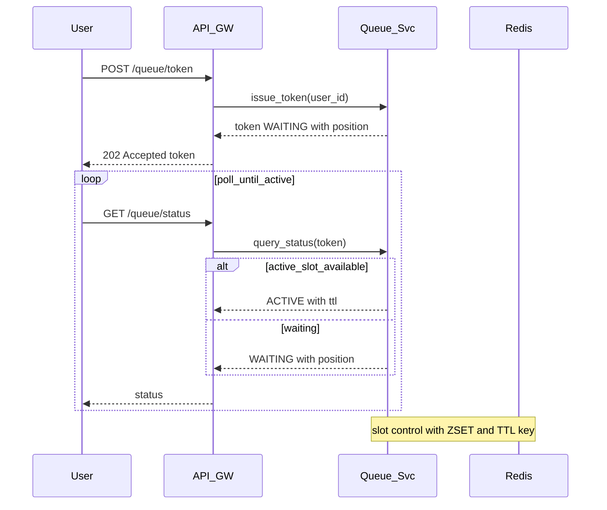
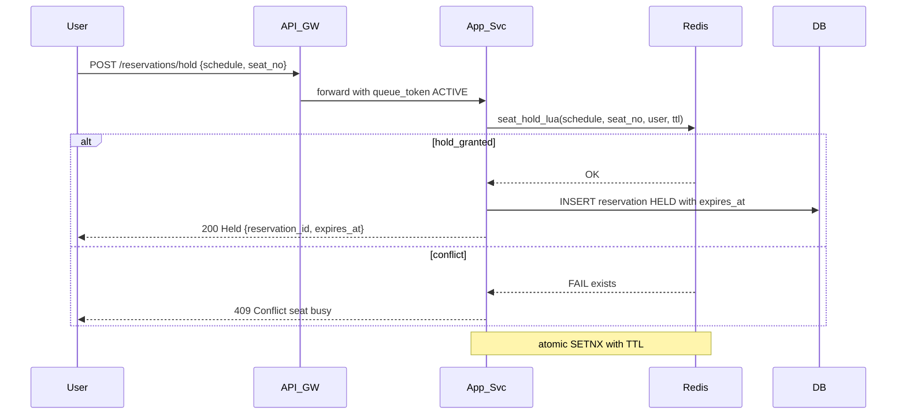
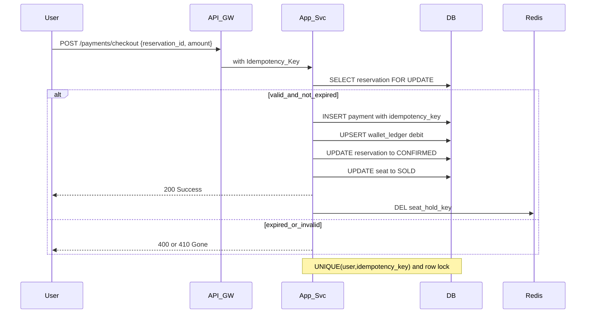
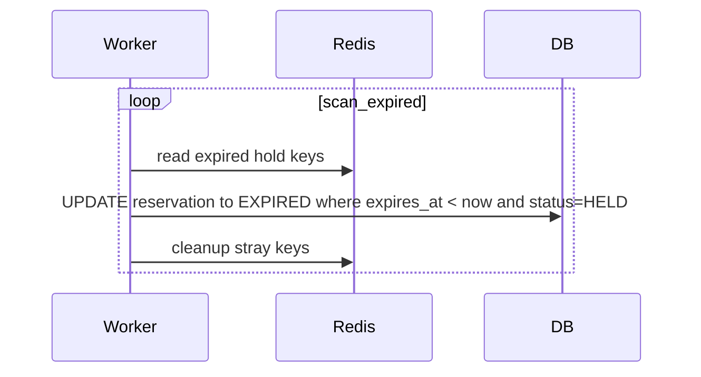

# 서버 설계 – 시퀀스 다이어그램

---

## 1) Queue Token 발급 및 활성화

```mermaid
sequenceDiagram
  participant U as User
  participant G as API_GW
  participant Q as Queue_Svc
  participant R as Redis

  U->>G: POST /queue/token
  G->>Q: issue_token(user_id)
  Q-->>G: token WAITING with position
  G-->>U: 202 Accepted token

  loop poll_until_active
    U->>G: GET /queue/status
    G->>Q: query_status(token)
    alt active_slot_available
      Q-->>G: ACTIVE with ttl
    else waiting
      Q-->>G: WAITING with position
    end
    G-->>U: status
  end

  Note over Q,R: slot control with ZSET and TTL key
```

---

## 2) 좌석 Hold (임시 배정)

```mermaid
sequenceDiagram
  participant U as User
  participant G as API_GW
  participant A as App_Svc
  participant R as Redis
  participant D as DB

  U->>G: POST /reservations/hold {schedule, seat_no}
  G->>A: forward with queue_token ACTIVE
  A->>R: seat_hold_lua(schedule, seat_no, user, ttl)
  alt hold_granted
    R-->>A: OK
    A->>D: INSERT reservation HELD with expires_at
    A-->>U: 200 Held {reservation_id, expires_at}
  else conflict
    R-->>A: FAIL exists
    A-->>U: 409 Conflict seat busy
  end

  Note over A,R: atomic SETNX with TTL
```

---

## 3) 결제 확정

```mermaid
sequenceDiagram
  participant U as User
  participant G as API_GW
  participant A as App_Svc
  participant D as DB
  participant R as Redis

  U->>G: POST /payments/checkout {reservation_id, amount}
  G->>A: with Idempotency_Key
  A->>D: SELECT reservation FOR UPDATE
  alt valid_and_not_expired
    A->>D: INSERT payment with idempotency_key
    A->>D: UPSERT wallet_ledger debit
    A->>D: UPDATE reservation to CONFIRMED
    A->>D: UPDATE seat to SOLD
    A-->>U: 200 Success
    A->>R: DEL seat_hold_key
  else expired_or_invalid
    A-->>U: 400 or 410 Gone
  end

  Note over A,D: UNIQUE(user,idempotency_key) and row lock
```

---

## 4) Hold 만료 워커

```mermaid
sequenceDiagram
  participant W as Worker
  participant R as Redis
  participant D as DB

  loop scan_expired
    W->>R: read expired hold keys
    W->>D: UPDATE reservation to EXPIRED where expires_at < now and status=HELD
    W->>R: cleanup stray keys
  end
```
